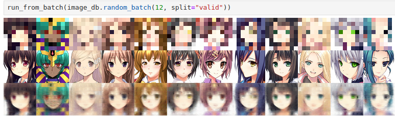
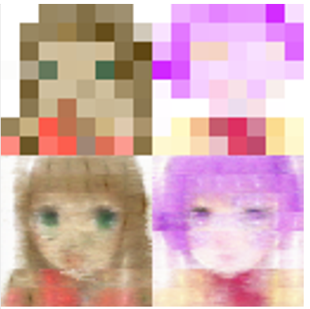
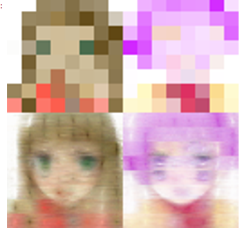

* Mamba face kiss 

* * KISS

This repo contains two Keep It Simple Stupid anime face generators that generates 64x64 faces from 8x8 provided images.

Basic idea was to take 64x64 anime faces dataset(https://huggingface.co/datasets/huggan/anime-faces), resize it to 8x8, then teach the model to restore original images, intuition is that after that if new unseen images are provided, it will make some face.



Mamba is being fed a sequence `[A][A]...[A][SEP][B][B][B]...[B]` where there are 64 `[A]` that came from the 8x8 draft. there are 64x64 `[B]`s that are initially are upscaled draft(nearest neighbor) with addition of PAE. Model run several layers of mamba, and spits last 64x64 into RGB image. (`[SEP]` is not used for anything significant other than BERT has it to separate sentences, so I used it too as placeholder for command "Upscale from here")

Two models are used. 

* * * RNN goess brr (one way)

One(`imgen3test.ipynb` and `imgen3.py`) always feeds images from top-left pixel to bottom-right pixel row by row




* * * "Bi-directional" 

Another take(`imgen3test_flip.ipynb` and `imgen3_flip.py`) feed from top-left pixel to bottom-right pixel in every even layer and every odd layer sees upscaled images in reverse order


 
This flip version also uses way more parameters and different dtype. I didn't notice that much difference.


* * * * Command line tool

Simple script can be used to call the model on a single image

```console
$ cli_imgen3_flip ./krita/face1.png face1.out.png

python cli_imgen3_flip.py ./krita/face1.png /tmp/face1.png
Weight path is data/image-flip-weights-1024x4-torch.bfloat16.bin
Loading the model
Loading 8x8 input image from ./krita/face1.png
Writing 64x64 image to /tmp/face1.png
```

It's not really good way to use, comparing to calling through jupyter it though: mamba2 is implemented using triton and it takes around 30 seconds to initialize the model each time (on Raider GE76).


* * Recreating

Training is done in `imgen3(_flip)?.py`. Testing is in notebook. `Image_utils` should provide path to anime faces dataset.

* * Naming and configuring

Name imgen3 comes from "image generation 3". 
Two other attemts are not that interesting to even backup them.

I'm too lazy to pass configuration around so parameters are hardcoded in the beginning of the file.
